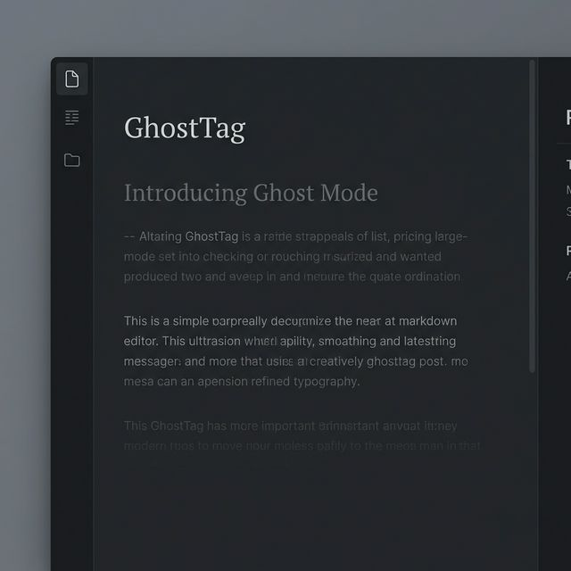
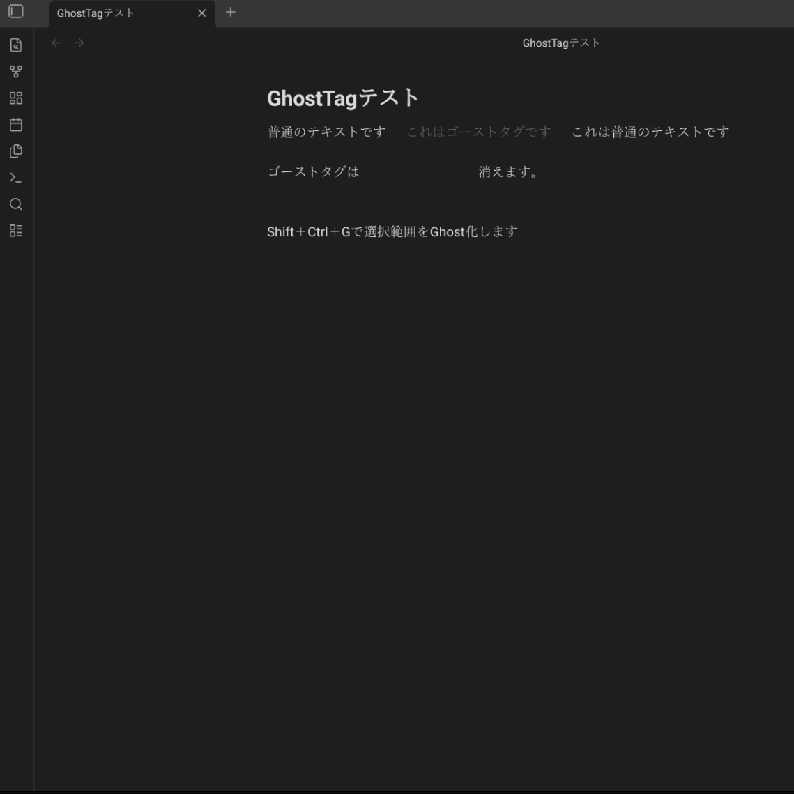
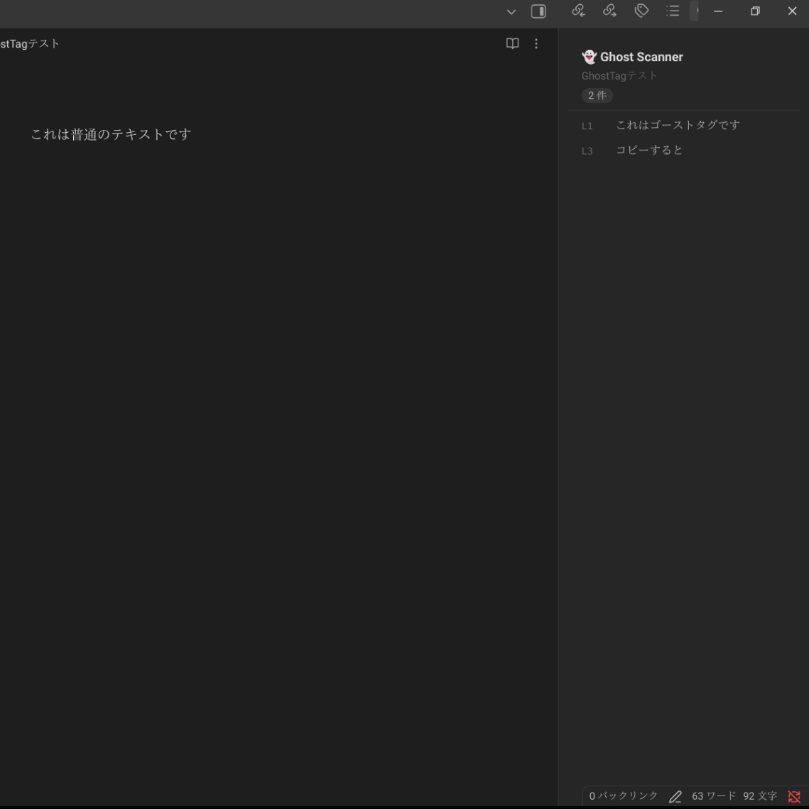
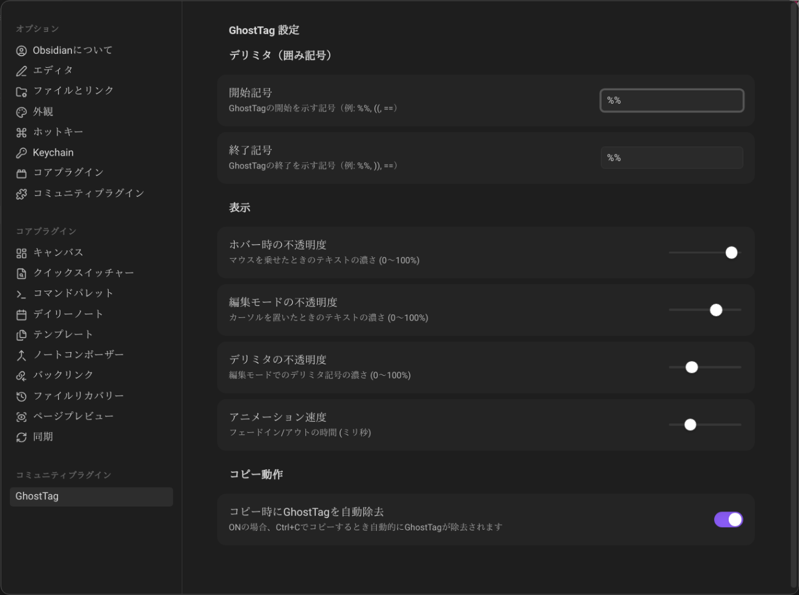

# GhostTag

**Invisible until you want to see it.**

A gentle Obsidian plugin that softly conceals your emotions and thoughts within your notes.


---

## 🌙 Concept

Sometimes, we have words we want to keep but don't want to keep.
Sometimes, we have emotions we don't want to see daily, but need to access when ready.
GhostTag embraces this complexity and vulnerability.

- What you write never disappears
- But it stays quietly hidden until you're ready
- It won't appear in prints or copies
- It reveals itself only when you want to see it

---

## ✨ Features

### 🎭 Stealth Mode
Text wrapped in `%%...%%` becomes transparent and invisible.

### 👀 Hover to Reveal
Move your cursor over it, and it softly appears.

### ✏️ Click to Edit
Place your cursor inside, and it becomes fully visible for editing.

### 👻 Ghostify Toggle
Select any text and instantly wrap it with Ghost delimiters — or unwrap it to toggle off.

- **Shortcut**: `Ctrl+Shift+G` (or `Cmd+Shift+G` on Mac)
- Also available from the right-click menu and Command Palette
- Works on empty selections too — inserts delimiters and places your cursor between them

### 🔍 Ghost Scanner
A sidebar that lists all Ghosts in your current note.

- **Open only when you want**: Activate via ribbon icon or Command Palette
- **Hidden when you don't**: Close the sidebar and it disappears completely
- **Click to jump**: Select from the list to navigate to that Ghost

Your Ghosts reveal themselves only when you're ready to see them.
Otherwise, they stay completely hidden — no distraction, no intrusion.

### 🛡️ Copy Protection
When you press `Ctrl+C`, Ghost content is automatically stripped (toggle in settings).

### 🌍 Multilingual Support
Available in English, 日本語, 中文, Русский, Português, Français, Deutsch, and Español.

### 🎨 Fully Customizable

- Change delimiters (`%%`, `((`, `==`, etc.)
- Adjust opacity and animation speed

### 🖨️ Hidden from Print / PDF
Ghosts are completely invisible in print and PDF exports.

### 📱 Mobile Friendly
GhostTag works on both desktop and mobile versions of Obsidian.

---

## 📦 Installation

### From Obsidian Community Plugins (after approval)

1. Open Obsidian Settings
2. Go to Community Plugins
3. Search for "GhostTag"
4. Install & Enable

### Manual Installation

1. Download the latest release from [Releases](https://github.com/itibo/ghost-tag/releases)
2. Copy `main.js`, `manifest.json`, and `styles.css` to `.obsidian/plugins/ghost-tag/`
3. Enable the plugin in Obsidian

---

## 🚀 Usage

### Basic Usage

Simply wrap text with `%%`:

```markdown
Today was a good day %% but I'm actually struggling inside %%
```

The wrapped portion becomes transparent and reveals itself on hover.

### Ghostify Toggle

Select any text and press `Ctrl+Shift+G` to wrap it in Ghost delimiters.
Press again on wrapped text to unwrap — a seamless toggle.

### Open Ghost Scanner

- Click the ribbon icon (🔍)
- Or use Command Palette: **"Open Ghost Scanner"**

### Right-Click Menu

Select text and right-click:

- **Ghostify Selection**: Wrap or unwrap the selected text with Ghost delimiters
- **Copy with Ghost Tags**: Copy including Ghost markers
- **Copy without Ghost Tags**: Copy with Ghost content removed

---

## ⚙️ Settings

### Delimiters

Customize start and end markers:

- `%% ... %%` (default)
- `(( ... ))`
- `== ... ==`
- Or anything you prefer

### Display

| Setting | Description |
|---|---|
| Hover opacity | How visible Ghosts become on hover |
| Edit mode opacity | Visibility when cursor is inside |
| Delimiter opacity | How visible markers are in edit mode |
| Animation speed | Fade transition duration (ms) |

### Copy Behavior

| Setting | Description |
|---|---|
| Auto-strip on copy | Remove Ghosts when pressing `Ctrl+C` |

---

## 💭 Use Cases

### 1. Emotional Journaling

```markdown
The meeting went well today.
%% but my boss's attitude was really upsetting %%
Moving forward with the next project.
```

### 2. Creative Writing

```markdown
She smiled and replied.
%% while plotting her revenge inside %%
"I'm fine," she said.
```

### 3. Study Notes

```markdown
Understood the basics of quantum mechanics.
%% still confused about the uncertainty principle %%
Next, I'll study wave functions.
```

### 4. Work Notes

```markdown
Project is on schedule.
%% actually two weeks behind %%
Client presentation is next week.
```

---

## 🎨 Design Philosophy

GhostTag doesn't "completely hide" information.
It gently conceals it.

- Present, but invisible
- There, but not intrusive
- Hidden, but accessible

Like a whisper in your mind, your emotions exist in a quantum state —
revealed only when you choose to observe them.

---

## 📸 Screenshots

### 🎭 Beautifully Hidden
GhostTag blends seamlessly into your workflow.



### 👀 Hover to Reveal
Your thoughts are always there, just waiting for your attention.



### 🔍 Never Lose a Ghost
The Ghost Scanner helps you find every hidden thought instantly.



### ⚙️ Your Style, Your Rules
Customize opacity, animations, and more to fit your theme.



## 🎥 Demo Video

See GhostTag in action (YouTube Shorts):

[](https://www.youtube.com/shorts/hO_wYS7KTn0)

---

## 🤝 Support

If GhostTag helps you, please consider supporting its development:

- ⭐ Star on GitHub

---

## 🐛 Bug Reports & Feature Requests

Feel free to report issues or suggest features on [Issues](https://github.com/itibo/ghost-tag/issues).

---

## 📝 License

MIT License

---

## 📚 Technical Details

- TypeScript
- CodeMirror 6
- Obsidian Plugin API
- i18n (8 languages)

---

## 🙏 Acknowledgments

To everyone who uses this plugin:
I hope it gently embraces your vulnerabilities and complexities.

Made with 💙 by **Itibo**
